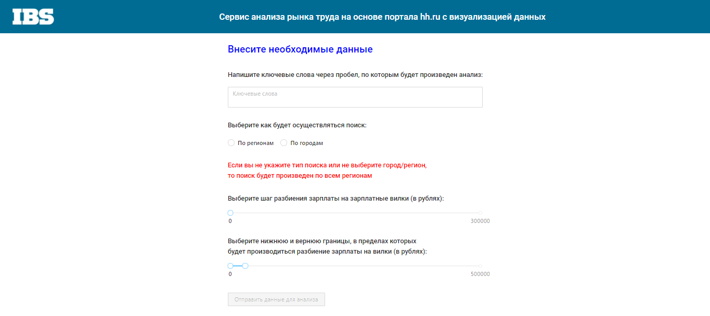
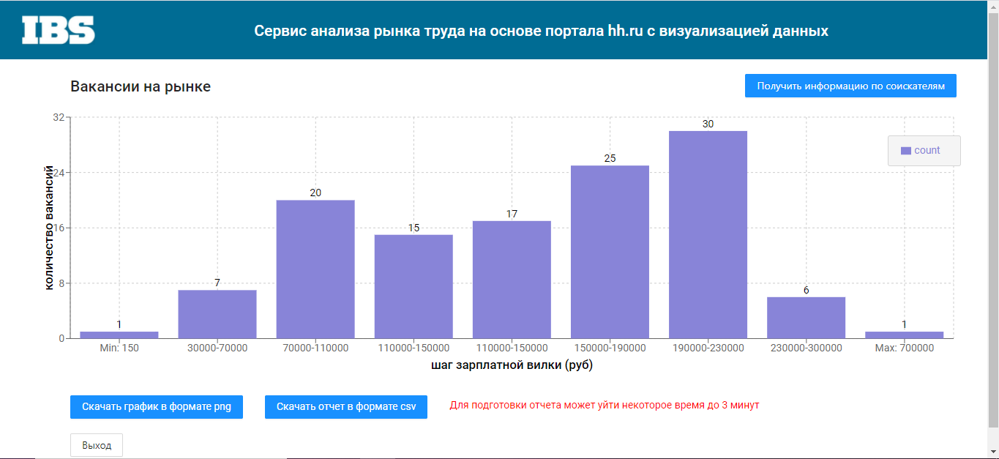
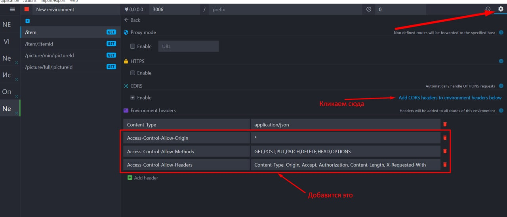
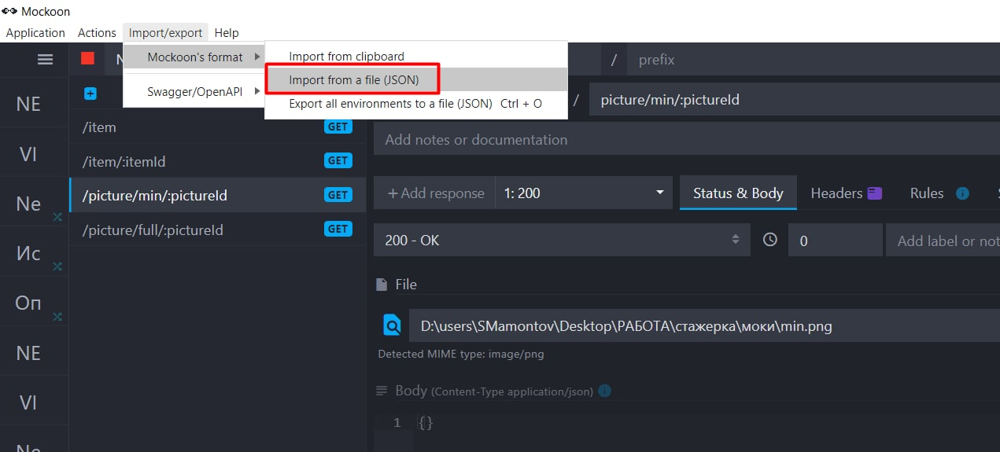
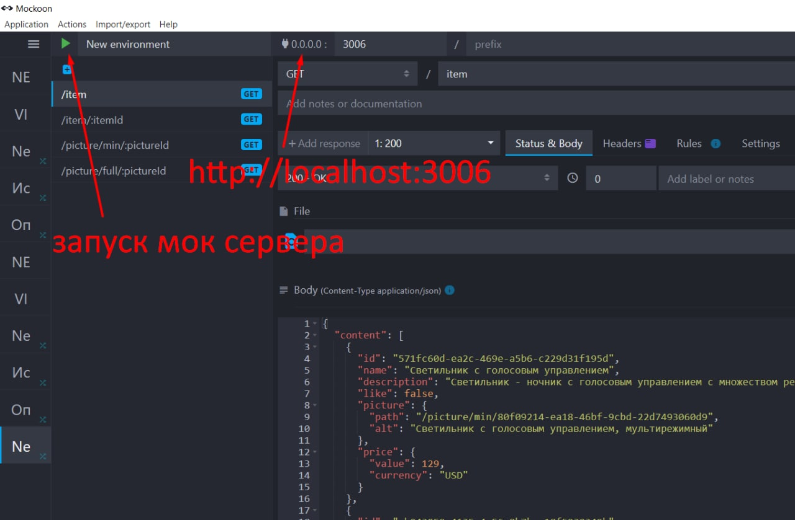

# Сервис анализа рынка труда на основе портала hh.ru с визуализацией полученных результатов
1. Функция – Поиск по ключевым словам. 
2. Ключевых слов может быть несколько на одном входе: Java, Java Developer, Java Senior Developer, Java программист.
Ввод следующих ограничений: 
- Количество символов, не превышает 80.
- Ключевое слово должно состоять минимум из трех символов, в случае если ключевое слово состоит из одного символа, то поиск по данному условия не осуществляется. 
3. По собранным вакансиям необходимо строить распределения зарплатных вилок в разрезе различных регионов (либо без региона – все регионы). Как минимум уметь показывать на гистограммах медианные значения, нижние и верхние границы.
4. Заработная плата: 
У пользователя есть возможность выставлять критерии отображения информации на гистограмме с помощью группировки шага, максимального и минимального предела. 
5. Функция выгрузки вакансии в зависимости от выбранных критериев на гистограмме. 

# Внешний вид приложения:
1. Страница заполнения данных 

2. Гистограмма

# Чтобы развернуть приложение у себя на компьютере:
1. Мок сервер, скачать, поставить - https://mockoon.com/
2. Чтобы избежать ошибки CORS (т. к. js файл лежит на диске, а не на дев сервере) делаем настройки как на скрине 1

3. Импорт мока - см. скрин 2 (архив с json для импорта и картинками лежит в папке "моки")

4. Запустить мок-сервер (см. скрин 3)

# Основные команды

### `yarn install`
Установить все зависимости приложения

### `yarn start`
Запустить приложение в режиме разработчика

### `yarn build`
Сделать билд приложения
